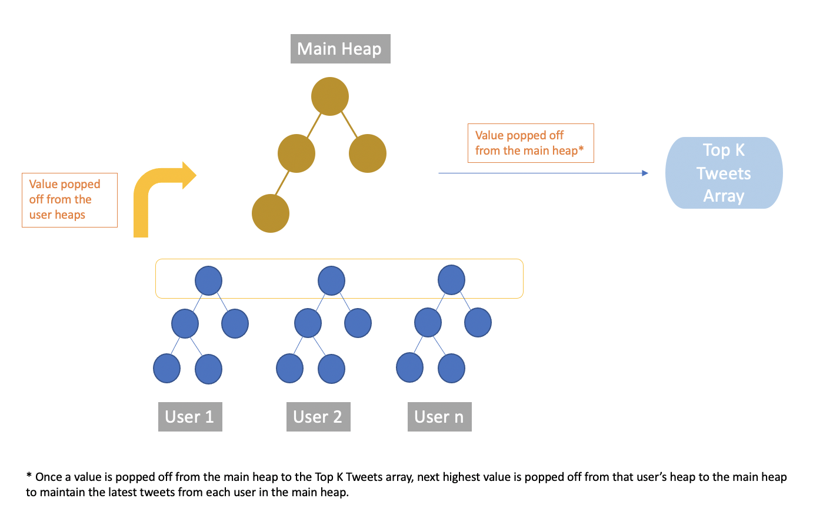

# ***Finding top K tweets for a user feed***

## **A) Installing Dependencies and Running the program**
### 1. Install dependency virtualenv using pip
	MACOS: python3 -m pip install --user virtualenv
	WINDOWS: py -m pip install --user virtualenv
### 2. Create a virtual environment 
	MACOS: python3 -m venv env
	WINDOWS: py -m venv env
### 3. Activate virtual environment
	MACOS: source env/bin/activate
	WINDOWS: .\env\Scripts\activate
### 4. Download dependencies from requirements.txt file
	pip install -r requirements.txt
### 5. Run the program
	MACOS: python3 main.py
	WINDOWS: python3 main.py
### 6. Deactivating the virtual environment 
	deactivate

## **B) Running tests**
### 1. Go to the root directory of the folder and run 
	python3 test.py

## **C) Assumptions**
 1. The user tweets data is static 
 2. The computation for the top k feeds takes place when the user requests the data
 3. The top k feeds are based only on timestamp. The more recent the tweet, the higher the position

 ## **D) Methodology Adopted**
 1. Each of the csv files are converted into pandas dataframes for easier processing 
 2. For a particular user with user_id, get all the user_ids he follows 
 3. For each user_id that the user follows, put the data in a heap. If the user follows 8 other users, there will be 8 heaps in total 
 4. The heap will be a maximising heap with timestamp as the index for decision
 5. A main heap is created that takes in data of the most recent tweet from each user heap 
 6. From the main heap, the values are popped to an array that contains the topK results
 7. This is repeated, until the array contains the topK feeds of the user from his followers
 
 

    

